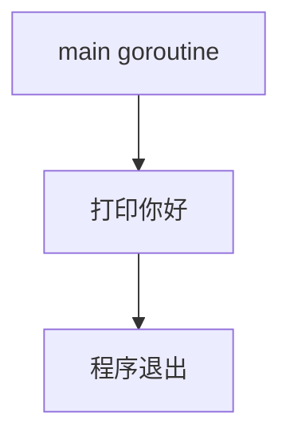
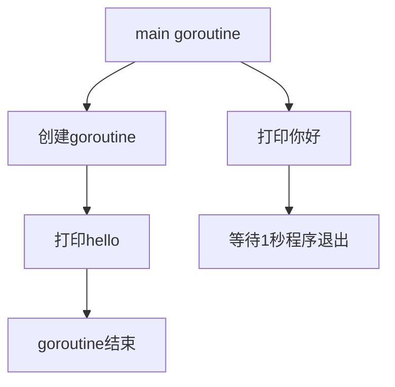

## 基本概念

>   串行、并发与并行

串行：有先后顺序

并发：同一个时间段内执行多个任务

并行：同一时刻执行多个任务


>   进程、线程、协程

进程：程序在操作系统中的一次执行过程，系统进行资源分配和调度的一个独立单位

线程：操作系统基于进程开启的轻量级进程，是操作系统调度执行的最小单位

协程：非操作系统提供而是用户自行创建和控制的用户态“线程”，比线程更轻量级


## 并发模型

常见的并发模型有：

-   线程&锁模型
-   Actor模型
-   CSP模型
-   Fork&Join模型

>   Go语言中的并发程序是通过基于CSP（communicating sequential process）的goroutine和channel来实现，也支持使用传统的多线程共享内存的并发方式


<!-- more -->


## goroutine

>   在一个Go程序中同时创建成百上千的`goroutine`是非常普遍的，一个goroutine会以一个很小的栈开始其生命周期，一般只需要2KB，goroutine是由Go的运行时`runtime`负责调度，会智能的将`m`个goroutine合理地分配给`n`个操作系统线程，实现类似：`m:n`的调度机制，不需要Go开发者自行在代码层面维护一个线程池。


**Goroutine是Go程序中最基本的并发执行单元。每一个Go程序都至少包含一个goroutine--main goroutine，当Go程序启动时它就会自动创建**


>   go关键字

Go语言中使用goroutine非常简单，只需要在函数或者方法调用钱加上`go`关键字就可以创建一个goroutine，从而让该函数或方法在新创建的goroutine里执行。

```go
go f() // 创建一个新的goroutine执行f函数
```

匿名函数也支持使用`go`关键字创建goroutine去执行

```go
go func() {
   // statment 
}()
```


```go
func hello () {
    fmt.Println("hello")
}

func main() {
    go hello()
    fmt.Println("你好")
}
```




这一次的执行结果只打印了“你好”，并没有打印`hello`

>   其实在Go程序启动时，Go程序会为main函数创建一个默认的goroutine，main函数中使用`go`关键字创建另外一个goroutine去执行hello函数，而此时main goroutine还在继续往下执行，即存在两个并发执行的goroutine。当main函数结束的时候，整个程序就结束了，同时main goroutine也结束了，所有由main goroutine创建的goroutine也会一同退出，也就是说main函数退出的太快，另外一个goroutine还没来得及执行程序就退出了，导致为打印出“hello”


所以我们要想办法让`main`函数等一等，可以让创建的goroutine执行完

```go
func hello () {
    fmt.Println("hello")
}

func main() {
    go hello()
    fmt.Println("你好")
    time.Sleep(time.Second) // 1秒 不写填1则为1纳秒
}
```

:::tip

现在出现：先打印你好后打印“hello”，是因为创建goroutine是需要资源的，会慢一步。

:::





在上面的程序里使用`time.Sleep`是非常不优雅的，也是不准确的。Go语言中通过`sync`包为我们提供了一些常用的并发愿语，使用`sync`的`waitGroup`，每创建一个goroutine，计数器加1，goroutine执行完成的时候计数器减1，在main函数中得到计数器为0的时候再继续执行。


```go
package main

import (
	"fmt"
	"sync"
)

var wg sync.WaitGroup

func hello() {
	fmt.Println("hello")
	wg.Done() // 告知当前goroutine完成
}

func main() {
	wg.Add(1) // 登记一个goroutine
	go hello()
	fmt.Println("你好")
	wg.Wait() // 阻塞等待所有goroutine完成
}

```

这一次就不会有多余的停顿。

```bash
你好
hello

```

如果怕忘记写`wg.Done`可以使用`defer wg.Done()`


```go
package main

import (
	"fmt"
	"time"
)

func main() {
	for i := 0; i < 1000; i++ {
		go func(i int) {
			for {
                // io 操作 会交出控制权
				fmt.Printf("hello from"+
					"goroutine + %d\n", i)
			}
		}(i)
	}

	time.Sleep(time.Millisecond)
}

```

协程：`Coroutine`，是一个轻量级的”线程“。

-   **非抢占式**多任务处理，由协程主动交出控制权
-   编译器、解释器、虚拟机层面的多任务，具体实现上会由调度器管理
-   多个协程可能在一个或多个线程上运行


我们如果把这个`i`不传递参数会怎么样？

```go
func main() {
    var a [10]int
	for i := 0; i < 10; i++ {
		go func() {
			for {
                a[i]++
                // 手动交出控制权
				runtime.Goexit()
			}
		}()
	}

	time.Sleep(time.Millisecond)
}
```

**这样就会报错**，会提示超出边界的`panic`，这是为什么呢?

>   因为使用的是同一个`i`，当`main`线程执行完之后，`i`最后的值会变成10，如果此时`a[10]++`，就会报超出边界的`panic`。

我们可以通过命令行参数来进行查看对比：

```bash
➜ go run -race goroutine.go          
==================
WARNING: DATA RACE
Read at 0x00c0000c4018 by goroutine 7:
  main.main.func1()
      /Users/GolangProjects/src/learngo/goroutine/goroutine.go:14 +0x70

Previous write at 0x00c0000c4018 by main goroutine:
  main.main()
      /Users/GolangProjects/src/learngo/goroutine/goroutine.go:11 +0xc6

Goroutine 7 (running) created at:
  main.main()
      /Users/GolangProjects/src/learngo/goroutine/goroutine.go:12 +0xa4
==================
==================
WARNING: DATA RACE
Read at 0x00c0000c8010 by goroutine 7:
  main.main.func1()
      /Users/GolangProjects/src/learngo/goroutine/goroutine.go:14 +0x94

Previous write at 0x00c0000c8010 by goroutine 8:
  main.main.func1()
      /Users/GolangProjects/src/learngo/goroutine/goroutine.go:14 +0x4b

Goroutine 7 (running) created at:
  main.main()
      /Users/GolangProjects/src/learngo/goroutine/goroutine.go:12 +0xa4

Goroutine 8 (finished) created at:
  main.main()
      /Users/GolangProjects/src/learngo/goroutine/goroutine.go:12 +0xa4
==================
panic: runtime error: index out of range [10] with length 10

goroutine 28 [running]:
main.main.func1()
        /Users/GolangProjects/src/learngo/goroutine/goroutine.go:14 +0xde
created by main.main
        /Users/GolangProjects/src/learngo/goroutine/goroutine.go:12 +0xa5
exit status 2

```


我们加上传递参数的之后再次运行：

```bash
➜ go run -race goroutine.go
==================
WARNING: DATA RACE
Read at 0x00c0000c8000 by main goroutine:
  runtime.racereadrange()
      <autogenerated>:1 +0x1b

Previous write at 0x00c0000c8000 by goroutine 7:
  main.main.func1()
      /Users/GolangProjects/src/learngo/goroutine/goroutine.go:14 +0x64
  main.main·dwrap·1()
      /Users/GolangProjects/src/learngo/goroutine/goroutine.go:18 +0x47

Goroutine 7 (finished) created at:
  main.main()
      /Users/GolangProjects/src/learngo/goroutine/goroutine.go:12 +0x7d
==================
[1 1 1 1 1 1 1 1 1 1]
Found 1 data race(s)
exit status 66

```

>   这个就代表，一个在读(`fmt.Println(a)`)，一个在写(`a[i]++`)，这个被它检查出来了，这个需要加上`channel`来进行解决，但是我们这里，只需要看下打印的结果就行了。


## 协程Corouting

-   子程序是协程的一个特例	


>   普通函数，在一个线程里，有一个`main`函数，它调用了`doWork`，等到`doWork`做完了，控制权才会交给`main`函数，才会继续去做其他的事情。


>   `main`和`doWork`之间是双向的，并且有通道，且控制权也是双向流通的，表示大家可以各做各的事情，他们可能运行在同一个线程里，可能不在，最终看调度器。


### 其他语言的协程

-   C++：`Boost.Coroutine`
-   Java：不支持
-   python的协程：
    -   使用`yield`关键字实现协程
    -   `python3.5`加入了`async def`对协程原生支持


### go语言的协程


-   任何函数只需加上`go`就能送给调度器运行
-   不需要在定义时区分是否是异步函数，这个是用来和`python`区分，`python`需要加上`async`
-   调度器在合适的点进行切换
-   使用`-race`来检测数据访问的冲突


### goroutine可能切换的点

-   `I/O`、`select`
-   `channel`
-   等待锁
-   函数调用（有时）
-   `runtime.Gosched()`
-   **上面只是参考，不能保证切换，不能保证在其他的地方不切换**


## 动态栈

操作系统的线程一般都有固定的栈内存(通常为2MB)，而Go语言中的goroutine非常轻量级，一个goroutine的初始栈空间很小（一般为2KB），所以在Go语言中一次创建数万个goroutine也是可能的。并且goroutine的栈不是固定的，可以根据需要动态地增大或缩小，Go的runtime会自动为goroutine分配合适的栈空间。


## goroutine调度

goroutine的调度是Go语言运行时(runtime)层面的实现，是完全由Go语言本身实现的一套调度系统`go scheduler`。它的作用是按照一定的规则将所有的goroutine调度到操作系统线程上运行。


在经历数个版本的迭代后，目前Go语言的调度器采用的是`GMP`调度模型

-   G：表示goroutine，每次执行`go f()`就创建一个G，包含要执行的函数和上下文信息
-   全局队列(Global Queue)：存放等待运行的G
-   P：表示goroutine执行所需要的资源，最多有GOMAXPROCS个
-   P的本地队列：同全局队列类似，存放的也是等待运行的G，存放的数量有限，不超过256个。新建G时，G优先加入到P的本地队列，如果本地队列满了会批量移动部分G到全局队列
-   M：线程相运行任务就得获取P，从P的本地队列获取G，当P的本地队列为空时，M也会尝试从全局队列或其他P的本地队列获取G。M运行G，G执行后，M会从P获取下一个G，不断重复下去。


## GOMAXPROCS

>   Go运行时的调度器使用GOMAXPROCS参数来确定需要使用多少OS线程来同时执行Go代码。默认是机器上的CPU核心数，Go语言可以通过`runtime.GOMAXPROCS`函数设置当前程序并发时占用的CPU逻辑核心数。


## 练习，输出下面的代码结果

```go
for i := 0; i < 5; i++ {
    go func() {
        fmt.Println(i) 
    }()
}
```

每次执行的结果都不太一样，此时的`i`是`for`循环里的变量，当执行到打印的时候，此时的`i`不能确定是多少。

```go
for i := 0; i < 5; i++ {
    go func(i int) {
        fmt.Println(i) 
    }(i)
}
```

这就会顺序打印
