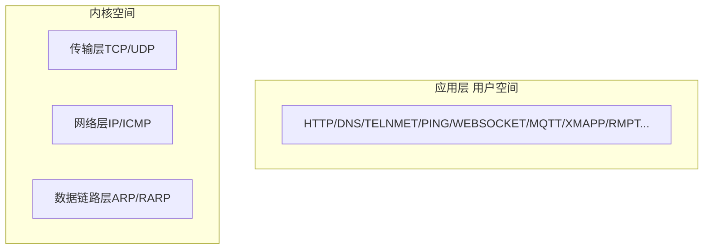

## 概述

>   编写的网络应用程序以`Socket API`来实现，变成语言虽然各不相同，但系统调用API完全一致，可以通过`Strace`工具跟踪系统调用。



操作系统以系统调用`Socket API`网络接口提供给引用层的程序。


-   数据链路层/ARP/RAPP：主要完成IP地址和物理MAC地址转换

    >   ARP请求：数据链路层接收到上层传递进来的数据，首先先拿到IP，再使用ARP程序发起一个请求，它会把对方IP和自己的IP，自己的物理地址MAC进行封装，封装后发送出去。

    >   ARP响应：网络上的主机接收到ARP请求时，会判断IP是不是自己，然后进行响应，把自己的IP，MAC发送给对方(网卡来发送)

    然后再把数据，MAC地址进行封装为数据帧`frame`：目的物理地址、源物理地址、数据。。。

    MAC物理地址一般存储再网卡的存储器里。

    

-   网络层IP、ICMP：主要就是数据的选路和转发

    ICMP：网络运维人员经常使用`ping,iptables`等配置

    接收数据时：它会进行判断，数据是不是发给自己的，

    -   如果是发给自己的，会传递到传输层，最终传递到应用层的某个具体进程【进程具有读写能力(接收数据和发送数据)】
    -   如果不是发给自己时：它会进行转发

    发送数据时：它会进行封装为IP数据包，发送到传输层


-   传输层

    TCP/UPD

    TCP: 基于流`Stream`的服务，字节流；特点：要进行连接才能通信，必须是全双工(双方都连接响应成功)，有序的、可靠的(有超时重传)。应用程序在收发数据时，需要自己去判断数据的边界，因为它像水一样没有边界【会涉及到数据粘包、少包的问题】

    UDP：数据报服务，传输数据是固定的，但是不可靠的，**发送方发送一次，接收方必须及时接收，否则数据丢弃**


-   应用层在实现的时候是调用下层提供的接口，准确来说是使用操作系统提供的使用函数：`socket api`；应用层在实现的时候，编程语言各不相同，写法也不一样，但是底层调用的函数是一样的。

    -   应用层的数据经过层层封装，经过TCP协议层封装时为`TCP报文段`，经过网络层变成`IP数据段`，到达数据链路层变成数据帧`frame`；

    -   接收数据的时候同样要经过每一层的处理

​	


## 使用命令来观察报文

>   可以使用`tcpdump`来抓包来查看数据经过TCP封装的报文观察

服务端代码案例：

```php
<?php

// 创建有一个socket文件描述符
$server = socket_create(AF_INET, SOCK_STREAM, 0);
// 绑定ip和端口
socket_bind($server, "0.0.0.0", 1234);
// 监听内核等待队列5个
if (socket_listen($server, 5)) {
    fprintf(STDOUT, "listen ok: on 1234");
}

// 阻塞接收客户端连接
$connfd = socket_accept($server);

// 数据读写
echo "recv: ".socket_read($connfd, 128);
echo "write len: ".socket_write($connfd, "hi", 2);

socket_close($server);
socket_close($connfd);
```

客户端代码：

```php
<?php

$client = socket_create(AF_INET, SOCK_STREAM, 0);


if (socket_connect($client, "127.0.0.1", "1234")) {
    echo "write len:".socket_write($client, "client", 5);
    echo "recv from server1: ".socket_read($client, 128);
}

socket_close($client);
```


我们将服务代码运行起来：`php server1.php`

```bash
[root@jb51 process]# php server1.php 
listen ok: on 1234
```


使用命令：`netstat -luntp`来查看监听的端口

```bash
root@jb51 process]# netstat -luntp
Active Internet connections (only servers)
Proto Recv-Q Send-Q Local Address           Foreign Address         State       PID/Program name    
tcp        0      0 0.0.0.0:1234            0.0.0.0:*               LISTEN 
6828/php
```

使用`tcpdump`命令来监听

```bash
[root@jb51 process]# tcpdump -X -AAA -i eth0 port 1234
tcpdump: verbose output suppressed, use -v or -vv for full protocol decode
listening on eth0, link-type EN10MB (Ethernet), capture size 262144 bytes

```

-   `eth0`是网卡，可以通过`ifconfig`去查看


最后我们在客户端执行客户端代码

```bash
[root@jb51 process]# /usr/bin/php client1.php 
write len:5recv from server1: hi
```

服务端响应内容：

```bash
[root@jb51 process]# php server1.php 
listen ok: on 1234recv: clienwrite len: 2
```

`tcpdump`监听报文内容

```bash
[root@jb51 process]# tcpdump -X -AAA -i eth0 port 1234
tcpdump: verbose output suppressed, use -v or -vv for full protocol decode
listening on eth0, link-type EN10MB (Ethernet), capture size 262144 bytes
21:31:54.825669 IP jb51.net.http > 103.142.100.9.search-agent: Flags [S.], seq 2011740119, ack 1598462250, win 29200, options [mss 1460,nop,nop,sackOK], length 0
        0x0000:  4500 0030 0000 4000 4006 552d 0a00 1004  E..0..@.@.U-....
        0x0010:  678e 6409 0050 04d2 77e8 b7d7 5f46 992a  g.d..P..w..._F.*
        0x0020:  7012 7210 fe10 0000 0204 05b4 0101 0402  p.r.............
21:32:03.025658 IP jb51.net.http > 103.142.100.9.search-agent: Flags [S.], seq 2011740119, ack 1598462250, win 29200, options [mss 1460,nop,nop,sackOK], length 0
        0x0000:  4500 0030 0000 4000 4006 552d 0a00 1004  E..0..@.@.U-....
        0x0010:  678e 6409 0050 04d2 77e8 b7d7 5f46 992a  g.d..P..w..._F.*
        0x0020:  7012 7210 fe10 0000 0204 05b4 0101 0402  p.r.............
21:32:19.025689 IP jb51.net.http > 103.142.100.9.search-agent: Flags [S.], seq 2011740119, ack 1598462250, win 29200, options [mss 1460,nop,nop,sackOK], length 0
        0x0000:  4500 0030 0000 4000 4006 552d 0a00 1004  E..0..@.@.U-....
        0x0010:  678e 6409 0050 04d2 77e8 b7d7 5f46 992a  g.d..P..w..._F.*
        0x0020:  7012 7210 fe10 0000 0204 05b4 0101 0402  p.r.............
```

-   eth0监听这个网卡
-   Ethernet以太网数据帧
-   21:31:54：当前时间
-   IP后面是客户端IP
-   103.142.100.9.search-agent: `hostnamectl`里的对应的你这台主机
-   Flags [S.]：TCP报文的一个标志，S：SYN，是一个同步报文，可以认为是一个连接报文
-   seq 2011740119：ISN序号值

```
IP jb51.net.http > 103.142.100.9.search-agent: Flags [S.], seq 2011740119, ack 1598462250, win 29200, options [mss 1460,nop,nop,sackOK], length 0
```

下面一个

```
IP jb51.net.http > 103.142.100.9.search-agent: Flags [S.], seq 2011740119, ack 1598462250, win 29200, options [mss 1460,nop,nop,sackOK], length 0
```


----

上面的先暂时放下，因为遇到了一个问题：

:::tip 关于抓取不到包的问题

`eth0`是一般用于以太网的接口，`lo`是指本地回环接口，第一次使用没有抓不到准确的数据包的原因是：本地回环不经过以太网卡，所以现在换成使用`-i lo`来抓取本地回环数据

:::


现在我重新换了一个`1235`的端口

:::details 查看内容

```bash
[root@jb51 process]# tcpdump -X -AAA -i lo port 1235
tcpdump: verbose output suppressed, use -v or -vv for full protocol decode
listening on lo, link-type EN10MB (Ethernet), capture size 262144 bytes
22:23:41.475469 IP VM-16-4-centos.48994 > VM-16-4-centos.mosaicsyssvc1: Flags [S], seq 714256101, win 43690, options [mss 65495,sackOK,TS val 4174891569 ecr 0,nop,wscale 7], length 0
        0x0000:  4500 003c 64d4 4000 4006 d7e5 7f00 0001  E..<d.@.@.......
        0x0010:  7f00 0001 bf62 04d3 2a92 aee5 0000 0000  .....b..*.......
        0x0020:  a002 aaaa fe30 0000 0204 ffd7 0402 080a  .....0..........
        0x0030:  f8d7 ca31 0000 0000 0103 0307            ...1........
22:23:41.475494 IP VM-16-4-centos.mosaicsyssvc1 > VM-16-4-centos.48994: Flags [S.], seq 877540770, ack 714256102, win 43690, options [mss 65495,sackOK,TS val 4174891569 ecr 4174891569,nop,wscale 7], length 0
        0x0000:  4500 003c 0000 4000 4006 3cba 7f00 0001  E..<..@.@.<.....
        0x0010:  7f00 0001 04d3 bf62 344e 35a2 2a92 aee6  .......b4N5.*...
        0x0020:  a012 aaaa fe30 0000 0204 ffd7 0402 080a  .....0..........
        0x0030:  f8d7 ca31 f8d7 ca31 0103 0307            ...1...1....
22:23:41.475512 IP VM-16-4-centos.48994 > VM-16-4-centos.mosaicsyssvc1: Flags [.], ack 1, win 342, options [nop,nop,TS val 4174891569 ecr 4174891569], length 0
        0x0000:  4500 0034 64d5 4000 4006 d7ec 7f00 0001  E..4d.@.@.......
        0x0010:  7f00 0001 bf62 04d3 2a92 aee6 344e 35a3  .....b..*...4N5.
        0x0020:  8010 0156 fe28 0000 0101 080a f8d7 ca31  ...V.(.........1
        0x0030:  f8d7 ca31                                ...1
22:23:41.476100 IP VM-16-4-centos.48994 > VM-16-4-centos.mosaicsyssvc1: Flags [P.], seq 1:6, ack 1, win 342, options [nop,nop,TS val 4174891570 ecr 4174891569], length 5
        0x0000:  4500 0039 64d6 4000 4006 d7e6 7f00 0001  E..9d.@.@.......
        0x0010:  7f00 0001 bf62 04d3 2a92 aee6 344e 35a3  .....b..*...4N5.
        0x0020:  8018 0156 fe2d 0000 0101 080a f8d7 ca32  ...V.-.........2
        0x0030:  f8d7 ca31 636c 6965 6e                   ...1clien
22:23:41.476157 IP VM-16-4-centos.mosaicsyssvc1 > VM-16-4-centos.48994: Flags [.], ack 6, win 342, options [nop,nop,TS val 4174891570 ecr 4174891570], length 0
        0x0000:  4500 0034 ff92 4000 4006 3d2f 7f00 0001  E..4..@.@.=/....
        0x0010:  7f00 0001 04d3 bf62 344e 35a3 2a92 aeeb  .......b4N5.*...
        0x0020:  8010 0156 fe28 0000 0101 080a f8d7 ca32  ...V.(.........2
        0x0030:  f8d7 ca32                                ...2
22:23:41.476198 IP VM-16-4-centos.mosaicsyssvc1 > VM-16-4-centos.48994: Flags [P.], seq 1:3, ack 6, win 342, options [nop,nop,TS val 4174891570 ecr 4174891570], length 2
        0x0000:  4500 0036 ff93 4000 4006 3d2c 7f00 0001  E..6..@.@.=,....
        0x0010:  7f00 0001 04d3 bf62 344e 35a3 2a92 aeeb  .......b4N5.*...
        0x0020:  8018 0156 fe2a 0000 0101 080a f8d7 ca32  ...V.*.........2
        0x0030:  f8d7 ca32 6869                           ...2hi
22:23:41.476237 IP VM-16-4-centos.mosaicsyssvc1 > VM-16-4-centos.48994: Flags [F.], seq 3, ack 6, win 342, options [nop,nop,TS val 4174891570 ecr 4174891570], length 0
        0x0000:  4500 0034 ff94 4000 4006 3d2d 7f00 0001  E..4..@.@.=-....
        0x0010:  7f00 0001 04d3 bf62 344e 35a5 2a92 aeeb  .......b4N5.*...
        0x0020:  8011 0156 fe28 0000 0101 080a f8d7 ca32  ...V.(.........2
        0x0030:  f8d7 ca32                                ...2
22:23:41.482154 IP VM-16-4-centos.48994 > VM-16-4-centos.mosaicsyssvc1: Flags [.], ack 3, win 342, options [nop,nop,TS val 4174891576 ecr 4174891570], length 0
        0x0000:  4500 0034 64d7 4000 4006 d7ea 7f00 0001  E..4d.@.@.......
        0x0010:  7f00 0001 bf62 04d3 2a92 aeeb 344e 35a5  .....b..*...4N5.
        0x0020:  8010 0156 fe28 0000 0101 080a f8d7 ca38  ...V.(.........8
        0x0030:  f8d7 ca32                                ...2
22:23:41.482203 IP VM-16-4-centos.48994 > VM-16-4-centos.mosaicsyssvc1: Flags [F.], seq 6, ack 4, win 342, options [nop,nop,TS val 4174891576 ecr 4174891570], length 0
        0x0000:  4500 0034 64d8 4000 4006 d7e9 7f00 0001  E..4d.@.@.......
        0x0010:  7f00 0001 bf62 04d3 2a92 aeeb 344e 35a6  .....b..*...4N5.
        0x0020:  8011 0156 fe28 0000 0101 080a f8d7 ca38  ...V.(.........8
        0x0030:  f8d7 ca32                                ...2
22:23:41.482222 IP VM-16-4-centos.mosaicsyssvc1 > VM-16-4-centos.48994: Flags [.], ack 7, win 342, options [nop,nop,TS val 4174891576 ecr 4174891576], length 0
        0x0000:  4500 0034 ff95 4000 4006 3d2c 7f00 0001  E..4..@.@.=,....
        0x0010:  7f00 0001 04d3 bf62 344e 35a6 2a92 aeec  .......b4N5.*...
        0x0020:  8010 0156 fe28 0000 0101 080a f8d7 ca38  ...V.(.........8
        0x0030:  f8d7 ca38                                ...8
```


:::


:::tip TCP三次握手


简单分析：

含有SYN的标志称为同步报文

>   IP VM-16-4-centos.48994 > VM-16-4-centos.mosaicsyssvc1: Flags [S], seq 714256101


这个时候标志多了`[S.]`，此时的`ack`比上面的`seq`多了1，这个就是确认报文

>IP VM-16-4-centos.mosaicsyssvc1 > VM-16-4-centos.48994: Flags [S.], seq 877540770, ack 714256102

这个是客户端的响应，标志没有了，这里有一个`ack 1`，也是确认报文，这里的`ack 1 = 877540770+1`的

>IP VM-16-4-centos.48994 > VM-16-4-centos.mosaicsyssvc1: Flags [.], ack 1


:::


P标志的意义提示尽快的去接收数据

>   IP VM-16-4-centos.48994 > VM-16-4-centos.mosaicsyssvc1: Flags [P.], seq 1:6, ack 1, win 342, options [nop,nop,TS val 4174891570 ecr 4174891569], length 5


服务端主动关闭：`FIN`标志：结束报文

>   IP VM-16-4-centos.mosaicsyssvc1 > VM-16-4-centos.48994: Flags [F.], seq 3, ack 6


客户端使用`ack`确认报文，并没有彻底关闭

>   IP VM-16-4-centos.48994 > VM-16-4-centos.mosaicsyssvc1: Flags [.], ack 3

客户端再使用`FIN`结束报文再发起一次确认

>   IP VM-16-4-centos.48994 > VM-16-4-centos.mosaicsyssvc1: Flags [F.], seq 6, ack 4

服务端最终确认关闭

>   IP VM-16-4-centos.mosaicsyssvc1 > VM-16-4-centos.48994: Flags [.], ack 7


服务端调用`listen`函数处于`LISTEN`状态

客户端调用`connect`函数发送`SYN`同步报文处于`SYN_SENT`

服务端使用`ACK`确认报文来进行确认，双方处于连接`ESTABLEISH`状态

下面双方就可以收发数据了，上面就是TCP三次握手的具体细节了。


### 切换语言来观察系统调用的函数是否一致

`server1.py`

```python
import socket

s = socket.socket()
host = "0.0.0.0"
port = 1235
s.bind((host, port), )

s.listen(5)

while True:
        c, addr = s.accept()
        print("连接地址: ", addr)
        c.send("nihao!")
        c.close()
```


对比

#### php

`strace -f -s 65500 /usr/local/php server1.php`直接看最底下的几行

```bash
socket(AF_INET, SOCK_STREAM, IPPROTO_IP) = 3
bind(3, {sa_family=AF_INET, sin_port=htons(1235), sin_addr=inet_addr("0.0.0.0")}, 16) = 0
listen(3, 5)                            = 0
write(1, "listen ok: on 1235", 18listen ok: on 1235)      = 18
```

-   socket(AF_INET, SOCK_STREAM, IPPROTO_IP) = 3：使用`socket`函数使用套接字，IPV4的协议`AF_INET`，套接字类型，然后具体协议，创建成功后返回文件描述符3
-   使用`bind`绑定函数，绑定1235端口
-   使用监听函数`listen`
-   使用`accept`函数阻塞


监听客户端

`strace -f -s 65500 /usr/local/php client1.php`

```bash
socket(AF_INET, SOCK_STREAM, IPPROTO_IP) = 3
connect(3, {sa_family=AF_INET, sin_port=htons(1235), sin_addr=inet_addr("127.0.0.1")}, 16) = 0
write(3, "clien", 5)                    = 5
write(1, "write len:5\n", 12write len:5
)           = 12
recvfrom(3, "hi", 128, 0, NULL, NULL)   = 2
write(1, "recv from server1: hi\n", 22recv from server1: hi
) = 22
close(3)                                = 0
close(0)   
munmap(0x7f0ce29b3000, 2176600)         = 0
munmap(0x7f0ce279a000, 2196680)         = 0
munmap(0x7f0cf10d3000, 192512)          = 0
munmap(0x7f0ce2599000, 2097248)         = 0
munmap(0x7f0ce44a6000, 4284872)         = 0
munmap(0x7f0ce4234000, 2560784)         = 0
munmap(0x7f0ce3dd1000, 4596616)         = 0
munmap(0x7f0ce3b84000, 2410688)         = 0
munmap(0x7f0ce389b000, 3050080)         = 0
munmap(0x7f0ce3697000, 2109928)         = 0
munmap(0x7f0ce3464000, 2302680)         = 0
munmap(0x7f0ce3254000, 2160296)         = 0
munmap(0x7f0ce3050000, 2109720)         = 0
munmap(0x7f0ce2e29000, 2255216)         = 0
munmap(0x7f0ce2bc7000, 2494984)         = 0
munmap(0x7f0cf1153000, 196608)          = 0
munmap(0x7f0ceae00000, 2097152)         = 0
munmap(0x7f0cf1032000, 659456)          = 0
munmap(0x7f0cf11ac000, 135168)          = 0
exit_group(0)                           = ?
+++ exited with 0 +++
```

然后服务端响应内容，等到有客户端进来就不阻塞了

```bash
socket(AF_INET, SOCK_STREAM, IPPROTO_IP) = 3
bind(3, {sa_family=AF_INET, sin_port=htons(1235), sin_addr=inet_addr("0.0.0.0")}, 16) = 0
listen(3, 5)                            = 0
write(1, "listen ok: on 1235", 18listen ok: on 1235)      = 18
accept(3, {sa_family=AF_INET, sin_port=htons(50626), sin_addr=inet_addr("127.0.0.1")}, [128->16]) = 4
recvfrom(4, "clien", 128, 0, NULL, NULL) = 5
write(1, "recv: clien\n", 12recv: clien
)           = 12
write(4, "hi", 2)                       = 2
write(1, "write len: 2\n", 13write len: 2
)          = 13
close(3)                                = 0
close(4)                                = 0
close(0)                                = 0
munmap(0x7f766dfb3000, 2176600)         = 0
munmap(0x7f766dd9a000, 2196680)         = 0
munmap(0x7f767c594000, 192512)          = 0
munmap(0x7f766db99000, 2097248)         = 0
munmap(0x7f766faa6000, 4284872)         = 0
munmap(0x7f766f834000, 2560784)         = 0
munmap(0x7f766f3d1000, 4596616)         = 0
munmap(0x7f766f184000, 2410688)         = 0
munmap(0x7f766ee9b000, 3050080)         = 0
munmap(0x7f766ec97000, 2109928)         = 0
munmap(0x7f766ea64000, 2302680)         = 0
munmap(0x7f766e854000, 2160296)         = 0
munmap(0x7f766e650000, 2109720)         = 0
munmap(0x7f766e429000, 2255216)         = 0
munmap(0x7f766e1c7000, 2494984)         = 0
munmap(0x7f767c614000, 196608)          = 0
munmap(0x7f7676400000, 2097152)         = 0
munmap(0x7f767c4f3000, 659456)          = 0
munmap(0x7f767c66d000, 135168)          = 0
exit_group(0)                           = ?
+++ exited with 0 +++
```


#### python

`strace -f -s 65500 python server1.py`

```bash
socket(AF_INET, SOCK_STREAM|SOCK_CLOEXEC, IPPROTO_IP) = 3
bind(3, {sa_family=AF_INET, sin_port=htons(1234), sin_addr=inet_addr("0.0.0.0")}, 16) = 0
listen(3, 5)                            = 0
accept4(3, 
```

同样的最底下的基层代码都是一样的。


## 总结

所以综上所述呢，不管啥编程语言，底层调用的系统函数完全一致，只是各个语法不一样。
