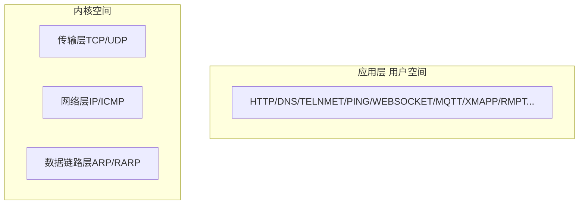

## 概述

>   编写的网络应用程序以`Socket API`来实现，变成语言虽然各不相同，但系统调用API完全一致，可以通过`Strace`工具跟踪系统调用。

操作系统以系统调用`Socket API`网络接口提供给引用层的程序。

-   数据链路层/ARP/RAPP：主要完成IP地址和物理MAC地址转换

    >   ARP请求：数据链路层接收到上层传递进来的数据，首先先拿到IP，再使用ARP程序发起一个请求，它会把对方IP和自己的IP，自己的物理地址MAC进行封装，封装后发送出去。

-   网络层IP、ICMP：主要就是数据的选路和转发

